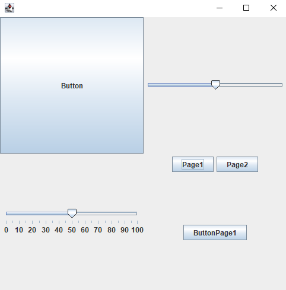

# scalaSimpleGUI
Declarative GUI library

## Example
We have the following code: </br>
```scala
val gui: GUI = GUI(
            SFrame("Window Name", GridLayout(2, 2))(
                SButton("Button"),
                SSlider("Slider", 0, 100),
                SSlider("SliderTicks", 0, 100, 50, SSlider.addTicks(5, 10, true)),
                PagePanel("PageThingi")(
                    "Page1" -> SButton("ButtonPage1"),
                    "Page2" -> SButton("ButtonPage2")
                )
            )
        )

        while(true)
            println(gui.awaitEvent())
```

This will result in the following gui: </br>


Clicking around the GUI we will get the following events
````
(PageSwitch(PageThingi,NO-PAGE,Page1),Map(SliderTicks -> 50, Slider -> 50))
(ButtonPressed(ButtonPage1),Map(SliderTicks -> 50, Slider -> 50))
(PageSwitch(PageThingi,Page1,Page2),Map(SliderTicks -> 50, Slider -> 50))
(ButtonPressed(ButtonPage2),Map(SliderTicks -> 50, Slider -> 50))
(ButtonPressed(Button),Map(SliderTicks -> 50, Slider -> 50))
(ButtonPressed(Button),Map(SliderTicks -> 50, Slider -> 50))
(SliderMovedEvent(SliderTicks),Map(SliderTicks -> 50, Slider -> 50))
(SliderMovedEvent(SliderTicks),Map(SliderTicks -> 51, Slider -> 50))
(SliderMovedEvent(SliderTicks),Map(SliderTicks -> 52, Slider -> 50))
(SliderMovedEvent(SliderTicks),Map(SliderTicks -> 53, Slider -> 50))
(SliderMovedEvent(SliderTicks),Map(SliderTicks -> 53, Slider -> 50))
````

## Usecase
If you want a simple GUI quickly. 